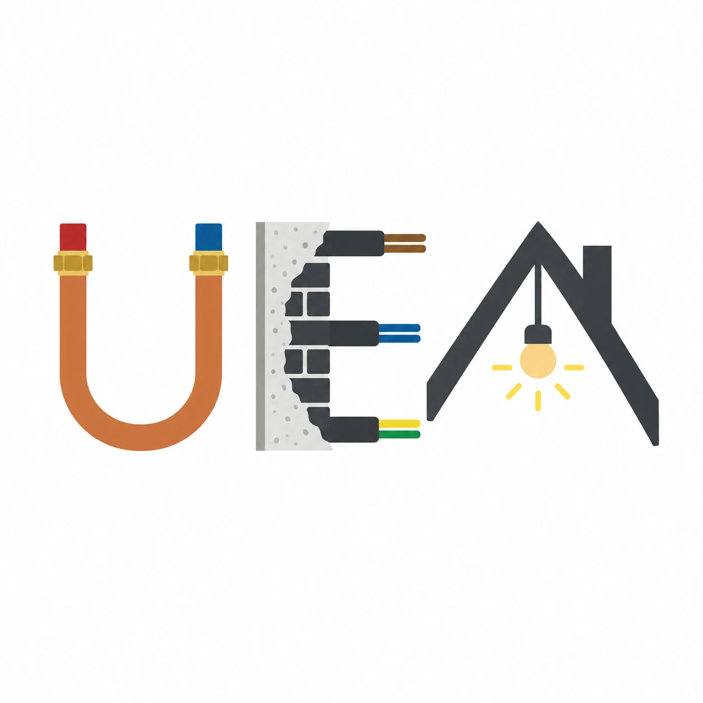

<p align="center"></p>

# UEA: Ultimate Engineering Assistant

Open-source engineering and building software made for AI agents. Not for humans: it is an AI-first program, and humans see its work only through what agents render and export for them.

Agents plan buildings in a compact text model through a CLI and a Python library, instead of driving GUI programs through screenshots. Tested code does the calculations. Humans get IFC, PDF and DWG plans, Excel tables and renders on demand, review them and sign.

**Status:** phase 1 in progress. The core and the architecture pack work: an agent can build, check and calculate the shell of an Einfamilienhaus and export it as IFC. Electrical, the other building services and structural are still designs. See `ROADMAP.md`.

## Why

Engineering software was built for humans clicking buttons. An AI agent driving it wastes most of its tokens looking at screens. UEA is built the other way round: text first, token-efficient, and usable by any agent with a shell. See `VISION.md`.

## Token cost

What it costs an agent to read one complete Einfamilienhaus, with architecture, electrical, heating, plumbing and ventilation (the [Haus Müller prototype](docs/prototype/haus-mueller/README.md), 226 elements):

| Same house as… | Tokens | vs. UEA |
|---|---|---|
| **UEA line format** (measured) | ~4,500 | 1× |
| Minimal, clean IFC (estimate) | ~50,000–150,000 | ~10–30× |
| IFC exported from Revit (estimate) | ~1–5 million | ~250–1,000× |
| Agent building the whole house with Revit via API and screenshots (estimate) | ~0.5–1 million | not like-for-like, see below |

Building the architecture of that house through the CLI, storeys and roof included, takes about 2,400 tokens of commands and UEA output (`bench/results.md`).

The first three rows are the cost of reading the model. The last row is a whole working session, so it is not comparable with them; the table by project size below compares a full build with a full build.

The UEA figures are counted with `tiktoken`; the others are rough estimates, not measurements. In UEA a wall is one line; in IFC it takes 20–40 entity lines, and a Revit export adds geometry for every device, quantities and its own property sets. The benchmark in `ROADMAP.md` (phase 5) will measure the comparison properly.

### In euros

Models bill by the million tokens. The three columns are example prices, from a cheap model to a frontier one; read the column that matches yours. One flat price for input and output, which real price lists split (output usually costs more).

| | Tokens | at €0.10 / M | at €1 / M | at €10 / M |
|---|---:|---:|---:|---:|
| Read the whole house, UEA line format (measured) | ~4,500 | €0.00045 | €0.0045 | €0.045 |
| Build its architecture through the CLI, commands and output (measured) | ~2,400 | €0.00024 | €0.0024 | €0.024 |
| Read the help once, to learn the tool (measured) | ~2,500 | €0.00025 | €0.0025 | €0.025 |
| An agent builds the shell and roof, whole conversation (measured, one run each) | 107,000–113,000 | €0.011 | €0.11 | €1.10 |
| The same house as minimal IFC (estimate) | 50,000–150,000 | €0.005–0.015 | €0.05–0.15 | €0.50–1.50 |
| The same house as IFC from Revit (estimate) | 1–5 million | €0.10–0.50 | €1–5 | €10–50 |
| An agent building the whole house with Revit via API and screenshots (estimate) | 0.5–1 million | €0.05–0.10 | €0.50–1 | €5–10 |

For €1 you get 10 million, 1 million or 100,000 tokens at the three prices. That is about 90, 9 or 1 agent builds of the house shell.

What the rows count:

- The first three rows are only the text that passes between the agent and UEA, counted by `uv run python -m bench` and `tools/prototype/count_tokens.py`. The agent's own thinking is not in them.
- The agent row is the whole conversation as the harness reported it: Claude Opus 107k, Claude Sonnet 113k, one run each on 2026-10-07 (`bench/agent/results.md`). It is a single run per model, not an average, and it predates the English format.
- An export (PDF, DXF, Excel, IFC) costs the agent one command and one line of output; the files are for humans, so the agent never reads them.
- The IFC and Revit rows are the estimates from the table above, not measurements.

### By project size

What a complete build costs an agent, from the brief to the exports: with conventional tools (IFC files, or Revit through its API and screenshots) and with UEA. These are our estimates, not measurements.

| Full build (estimate) | Tokens | at €0.10 / M | at €1 / M | at €10 / M |
|---|---:|---:|---:|---:|
| A normal house, conventional tools | 0.5–1 million | €0.05–0.10 | €0.50–1 | €5–10 |
| **A normal house, UEA** | **50,000–100,000** | €0.005–0.01 | €0.05–0.10 | €0.50–1 |
| A medium project, conventional tools | 5–50 million | €0.50–5 | €5–50 | €50–500 |
| **A medium project, UEA** | **0.5–5 million** | €0.05–0.50 | €0.50–5 | €5–50 |
| A large project such as a hospital, conventional tools | 50 million–1 billion | €5–100 | €50–1,000 | €500–10,000 |
| **A large project such as a hospital, UEA** | **5–100 million** | €0.50–10 | €5–100 | €50–1,000 |

- **What is counted:** everything the agent spends on the build, the whole conversation: the commands it writes, what it reads back, corrections, checks and calculations, its own thinking.
- **What the numbers are:** the conventional ranges are our estimates. The UEA ranges are a tenth of them, a planning figure. No medium or large project has been built with UEA, and heating, plumbing, ventilation and structural are not built yet (`ROADMAP.md`, phases 6–8), so not even a complete house has been measured.
- **What has been measured:** one agent run built only the shell and roof of the house, for 107,000–113,000 tokens (`bench/agent/results.md`, 2026-10-07). That is above the house range for UEA. It was the first run, before the help was fixed from what the agents had to guess, and a rerun is open (`ROADMAP.md`); the house range assumes that a complete house can be done for less than that first run. Treat it as a target, not a result.
- **Why UEA is expected to cost less, and to grow about in line with the project:** an element is one line, and its connections are ids (a socket names its wall and its circuit), not geometry or relationship objects. An agent reads only the part it asks for (`uea show`, `uea get`, `uea find`). The cost follows the number of elements and the number of changes.
- **Why IFC and Revit grow faster:** every element also carries relationships: its type or family, materials, property sets, spatial containment and connections to other parts. The number of those grows faster than the number of elements, so the files, and what an agent must read to work on them, grow faster than the project. The table keeps UEA at a flat tenth at every size, which is the cautious reading; if the conventional cost grows faster, as we expect, the gap is wider. That has not been measured, and the benchmark in `ROADMAP.md` (phase 5) is meant to do it.

## Try it

Needs Python 3.12+ and [uv](https://docs.astral.sh/uv/).

```bash
uv sync --all-extras
uv run uea help
```

An agent's first steps look like this:

```bash
uea init haus && cd haus
uea apply --by arch-agent -m "Geschosse, Achsen, Typen" <<'EOF'
+ project haus "EFH"
+ level EG z=0 fb=0.15 head=2.26
+ level OG z=2.875 fb=0.15 head=2.26
+ grid W x=0
+ grid E x=10.49
+ grid S y=0
+ grid N y=8.49
+ type AW-365 wall layers=plaster:0.015,*brick:0.365,render:0.02
EOF
uea apply --by arch-agent -m "Außenwände" <<'EOF'
+ wall @s EG AW-365 y=S+ x=W..E lb
+ wall @n EG AW-365 y=N- x=W..E lb
+ wall @w EG AW-365 x=W+ y=@s..@n lb
+ wall @o EG AW-365 x=E- y=@s..@n lb
+ room _ EG living at=@w+1,@s+1
EOF
uea get r1          # shell 9.76x7.76=75.74 | fin 9.73x7.73=75.21 | ...
uea render EG       # out/plan-EG.png
uea export ifc      # out/haus.ifc
```

Development: `uv run pytest`, `uv run ruff check`, `uv run pyright`, and `uv run python -m bench` for the token task set.

## Scope

Buildings first: architecture, electrical, plumbing, heating, ventilation, lighting and structural, each as a domain pack on a shared core. Later directions are in `FUTURE.md`.

## Docs

| File | Content |
|---|---|
| `VISION.md` | What UEA is, why, and what it is not |
| `ARCHITECTURE.md` | How it is built: core, domain packs, file format, CLI, calculators, exports |
| `ROADMAP.md` | Phases up to the Einfamilienhaus demo |
| `FUTURE.md` | Ideas beyond the first scope |
| `docs/decisions/` | Major decisions with alternatives and reasons |
| `docs/prototype/haus-mueller/` | A complete Einfamilienhaus in the draft format, written by hand |
| `docs/validation/` | Validation reports of the `norm` calculators |
| `src/uea/` | The code: core, packs, CLI, calculators, exports |
| `tests/` | Tests with hand-computed expected values |
| `docs/reference.md` | Every command, element kind, field and issue code, generated from the code |
| `bench/` | The token task set and its last results; `bench/agent/` lets an agent build Haus Müller from a brief |
| `tools/` | Throwaway prototype scripts that check the prototype and generate its plans |

## Licence

Apache-2.0.

A human signs. UEA does not certify anything or replace a licensed engineer.
