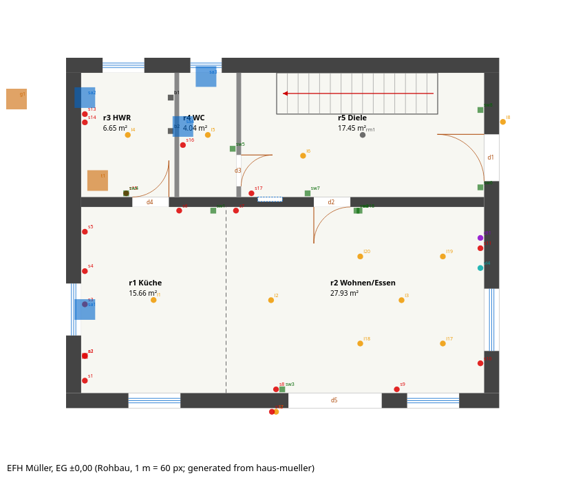
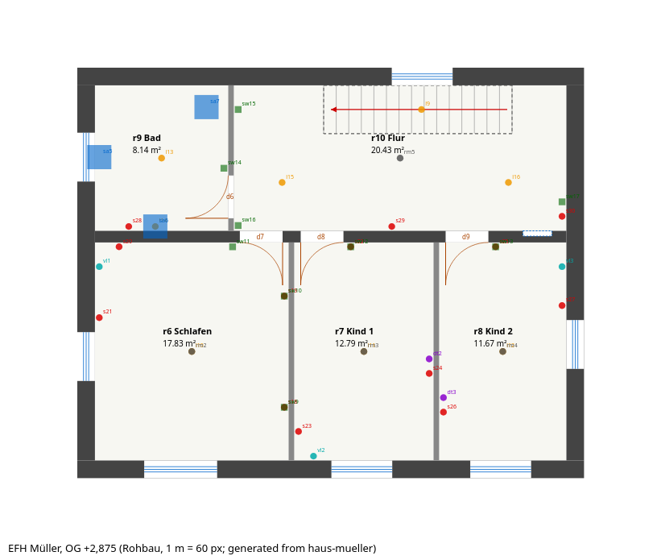

# Prototype: Haus Müller

A normal Einfamilienhaus, written by hand in the draft format before any code exists, to test the format and to settle the open datum questions. It is the first candidate for the token task set (`ROADMAP.md`).

Status: draft, 2026-10-07. Since 2026-10-09 `project`, `arch`, `light` and `elec` load in UEA (the `illum` targets and the `feed` lines to the heat pump and the fans wait for the lighting design and for heat and vent). The syntax will change. Types, cables, protective devices and products are illustrative placeholders, not design data. No Fachplaner has checked the design.

## The house

Two full storeys and a cold Spitzboden under a 25° Satteldach. Masonry, 36,5 cm Ziegel outside, 10,49 × 8,49 m in Oktameter. Heated by an air-to-water heat pump with Fußbodenheizung, ventilated by two pairs of decentral units.

| Room | Finished m² | | Room | Finished m² |
|---|---|---|---|---|
| r1 Küche | 15.66 | | r6 Schlafen | 17.83 |
| r2 Wohnen/Essen | 27.93 | | r7 Kind 1 | 12.79 |
| r3 HWR | 6.65 | | r8 Kind 2 | 11.67 |
| r4 WC | 4.04 | | r9 Bad | 8.14 |
| r5 Diele (with stair) | 17.45 | | r10 Flur (with stair hole) | 20.43 |
| **EG** | **71.72** | | **OG** | **70.85** |

Floor areas between finished wall surfaces. Not the Wohnfläche: WoFlV deductions (stair, hole) are a calculator's job.

Electrical: SLS, SPD, 5 RCDs, 19 circuits, 30 socket boxes (45 outlets), 18 switches, 20 luminaires, 3 data outlets, 5 Rauchwarnmelder, feeds for the heat pump, the indoor unit and four fans.

## Exports

Everything in `exports/` is generated from the `.uea` files by a throwaway script outside the repository. These are not UEA exports; they show what the model must be able to deliver. Drawings are SVG with a PNG copy; labels are German, because German offices read them.

| Export | Content |
|---|---|
| [Grundrisse](exports/grundriss-EG.png) | EG and OG with every element of every discipline |
| [Ansichten](exports/ansichten.png) | North, east, south and west elevations, with heights from the roof geometry (ridge +8.10, eaves +6.12) |
| [Elektro EG](exports/elektro-EG.png), [OG](exports/elektro-OG.png) | Installationspläne with simplified DIN EN 60617 symbols, circuits and switching lines. Aus-, Serien-, Wechsel- and Kreuzschaltung are derived from how many switches control each luminaire |
| [Verteilungsplan](exports/verteilung-b1.png) | Single-line diagram of b1 and its Belegung (6 rows of 12 TE). The phase assignment is derived |
| [Heizungsschema](exports/heizungsschema.png) | Heat pump, indoor unit, manifolds with FBH loops per room, drinking-water fixtures |
| [Lichtberechnung r2](exports/lichtberechnung-r2.md) | A `custom` calculation, not norm-compliant: point-by-point direct light plus an indirect estimate, two variants against the targets in `light.uea` |

## Files

| File | Lines | Characters |
|---|---|---|
| `project.uea` | 8 | 208 |
| `arch.uea` | 72 | 3,294 |
| `light.uea` | 25 | 838 |
| `elec.uea` | 89 | 3,031 |
| `heat.uea` | 14 | 324 |
| `plumb.uea` | 7 | 188 |
| `vent.uea` | 4 | 170 |
| `issues.uea` | 7 | 593 |
| **Total** | **226** | **8,646** |

`session.md` shows how an agent builds this through the CLI: batches, placeholders, a request, an upstream change that breaks the electrical design, a revert, and a calculation that leads to a design change.

### Tokens

Counted with `tools/prototype/count_tokens.py` and `tiktoken` (`o200k_base`). That is OpenAI's tokenizer, so the absolute numbers are an approximation for Claude; the ratios are what matter.

| Format, same 226 elements | Tokens | Per element | vs. line format |
|---|---|---|---|
| Line format (all `.uea` files) | 4,471 | 19.8 | 1.00× |
| JSON, minified | 7,627 | 33.7 | 1.71× |
| YAML | 9,045 | 40.0 | 2.02× |
| JSON, indented | 12,273 | 54.3 | 2.75× |

The whole house costs about 4,500 tokens to read. The JSON and YAML versions keep the same compact values (`y=w1+4.51` stays a string), so the table measures the syntax alone. A format with coordinates instead of intent would cost more. The operation lines shown in `session.md` take 1,454 tokens; all of its CLI blocks, commands and output, take 3,179.

## Conventions

Decided in `docs/decisions/0012-datums-and-positions.md`; this prototype is the worked example.

### Datums

- **Plan positions are core faces** (Rohbau): the faces of a type's core layer, marked `*` in its layers. Finished sizes are derived from the other layers.
- **Heights count from the storey's FFL** (OKFF). A level's `z` is its FFL (±0.00 = FFL of the ground storey). `fb` is the floor build-up, so the SSL (OK Rohdecke) = `z − fb`.
- **Openings** have structural sizes `W x H` (Rohbaurichtmaße). Windows hang from the storey's head height (`level EG ... head=2.26`), so their sill is derived; `sill=` is written only for a window that deviates. Doors stand on OKFF.
- **Devices:** `z` is the box centre above the FFL. A device's position along its wall is its centre; an opening's position is its edge, as in a dimension chain (Maßkette).

### Positions

| Expression | Meaning |
|---|---|
| `x=w4+2.26` | My −x side is 2.26 beyond w4's +x face; I extend in +x. A clear dimension, as in a dimension chain |
| `x=E-` | My +x side is on grid E; I extend in −x |
| `y=w5.n-` | Explicit face: my +y side on w5's north face |
| `x=d4+0.25` | 0.25 past the + edge of opening d4 |
| `y=f2.c` | On the centre of window f2 |
| `y=w1..w3` | Span between the faces of w1 and w3 that face each other |
| `on=w1` | Same footprint as w1 (a wall stacked on another) |
| `at=w4+1,w1+1` | A point (room seeds, ceiling lights, equipment on the floor) |
| host `w5.s` | The south face of w5. An exterior wall without a face means its inside face |

Everything resolves relative to something else. Make the HWR wider by moving w6, and w7, d2, d4, the board, the switches next to the doors and the WC washbasin follow.

### Names, ids, placeholders

- The agent names levels, grids and types (`EG`, `W`, `AW-365`). UEA assigns the ids of all other elements.
- Names and ids start with a letter. German numeric axes get a letter name and a drawing label (`grid A1 x=0 label=1`).
- Grid and level names contain no `-`: in a position, `W-1.2` means grid W minus 1.2 m.
- Placeholders in a batch are `@name`, not `$name`: a shell expands `$name` when an agent forgets to quote its heredoc. `_` adds an element that nothing in the batch refers to.

| Pack | Kinds and id prefixes |
|---|---|
| arch | `wall` w, `door` d, `win` f, `niche` ni, `slab` sl, `void` v, `roof` rf, `stair` st, `sep` rs, `room` r |
| light | `lum` l |
| elec | `board` b, `rcd` fi, `circ` c, `sock` s, `conn` a, `switch` sw, `data` dt, `smoke` rm, `feed` fd |
| heat | `gen` g, `tank` t, `man` hv, `ufh` uh |
| plumb | `san` sa |
| vent | `fan` vl |
| issues | `req` q, `waive` wv |

### Defaults

`sock` and `data` at z=0.30, `switch` at 1.05. Ceiling luminaires and smoke alarms at the room centre unless `at=` says otherwise. Windows and doors use the type marked `default`. A slab's outline comes from the walls below it, a stair hole from `over=`.

### Derived, not stored

Whether a wall is exterior, wall joins, room outlines (from the seed point), stair run and riser height (st1: 16 risers of 18.0 cm, tread 26 cm, 2h+a = 61.9 cm), Wechsel- and Kreuzschaltung (from how many switches control one luminaire), the number of FBH circuits per room, cable routes along the installation zones, and the second half of each fan pair.

### Switching

`ctl=l2,l3` is a Serienschalter with one rocker per luminaire. `ctl=l15+l16` switches both together. Several switches on one luminaire make a Wechsel- or Kreuzschaltung, and they must share a circuit.

## What the exercise showed

1. A masonry EFH needs only four grids for its outline. Everything else is placed like a dimension chain: a clear dimension from a wall face.
2. The sign in every position (`+` or `−`) is what makes it unambiguous: it says from which face and in which direction.
3. Name fields and position fields must stay apart. That is why names contain no `-`.
4. `on=` was needed for every wall stacked on the one below (5 of 17 walls).
5. Interior walls need a face when they host a device (`w6.w`); exterior walls do not.
6. The review script found its first validator rules: unknown references, a device inside or within 10 cm of an opening, back-to-back boxes in an 11,5 cm wall, and a switch on the hinge side of a door that opens into its room. The model passes all of them.
7. Six requests came up naturally (two niches, a Durchbruch, core drillings, door handing, Betoneinbaugehäuse for downlights). A request can name several targets (q4).
8. Every export asked for something the model lacked, and each gap was one small field: the terrain height (`ground=`) for the Ansichten; SLS, SPD and meters on the board for the Verteilungsplan; `src=` links for the Heizungsschema; luminaire types with flux and distribution, plus targets (`illum`), for the Lichtberechnung.
9. Drawing the door swings in the electrical plan showed five doors hinged on the side of their light switch. The check became a validator rule. The warning belongs to Elektro, which placed the switches; it asked Architektur to turn the doors (q5), and Architektur did.
10. The Lichtberechnung ran the loop the architecture intends: code calculated, variant A missed the target, the agent added four dimmed downlights, code calculated again. The downlights then needed a request to Architektur (q6), because the ceiling is concrete.
11. The Heizungsschema derives 9 FBH loops for the EG manifold. Whether they fit the 0,60 m niche that heat asked for in q1 is a cross-discipline check that needs manufacturer data.

## Not in the prototype

- Structure: lintels, ring beams, load paths. It needs its own design session with a Tragwerksplaner.
- Pipe and duct networks, Fallleitung, Grundleitungen, Hausanschluss. Cable routes are derived.
- Furniture and the kitchen layout; devices are placed directly.
- Attic access, railings, Außenanlagen, Schnitte. Window sash divisions, Sockel, gutters.
- Results: Wohnfläche per WoFlV, Heizlast, cable sizing and voltage drop. The lighting calculation is a `custom` prototype.

## Decided after the prototype

- Datums, the position grammar, window heads from the storey's head height, the roof's `knee` (then `kn`) as a construction value, and names for numeric axes: `docs/decisions/0012-datums-and-positions.md`.
- `into=` and `hand=` are enough to draw every door swing.
- A check that involves two disciplines belongs to the downstream one, which asks upstream with a request (`ARCHITECTURE.md` §7).
