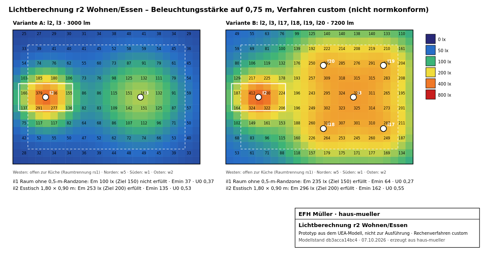

# Lichtberechnung r2 Wohnen/Essen

> **Rechenverfahren: `custom`, nicht normkonform.** Ein Prototyp, um zu zeigen, wie ein Rechenergebnis aus dem Modell aussieht. Die Lichtstärkeverteilungen sind Platzhalter (cosⁿ), keine Herstellerdaten (LDT). Für Wohnräume gibt es keine verbindlichen Mindestwerte; die Ziele sind Planungsannahmen aus `light.uea` (il1, il2).

| | |
|---|---|
| Rechner | `light-point` 0.0.1, Kind `custom` |
| Modellstand | `db3acca14bc4` |
| Datum | 07.10.2026 |
| Raum | r2 Wohnen/Essen, EG, Fertigmaß 6,235 × 4,480 m = 27,93 m², lichte Höhe 2,515 m |
| Nutzebene | 0,75 m über OKFF, Raster 0,25 m (25 × 18 Punkte) |
| Wartungsfaktor | 0,80 |
| Reflexionsgrade (Annahme) | Decke 0,7, Wände 0,5, Boden 0,3; Mittel 0,50 |

## Verfahren

Direktanteil Punkt für Punkt: E = MF · I₀ · cos^(n+1) γ / d², mit I₀ = Φ (n+1) / 2π für eine nach unten strahlende cosⁿ-Verteilung. Indirektanteil gleichmäßig über den Raum: der direkt auf die Nutzebene fallende Lichtstrom wird mit dem Boden-, der Rest mit dem Wand-Reflexionsgrad einmal reflektiert und dann gemittelt verteilt: E_ind = (Φ_dir · ρ_Boden + Φ_rest · ρ_Wand) / (A · (1 − ρ)), A = alle Raumflächen. Die offene Seite zur Küche wird wie eine Wand behandelt; Licht aus der Küche (l1) zählt nicht.

## Leuchten

| Leuchte | Typ | Lichtstrom | Verteilung | Position x / y | Lichtpunkthöhe |
|---|---|---|---|---|---|
| l2 | PL-12 | 1200 lm | cos1 | 4,965 / 2,615 | 1,600 m |
| l3 | DK-18 | 1800 lm | cos1 | 8,125 / 2,615 | 2,515 m |
| l17 | DL-11 | 1050 lm | cos3 | 9,125 / 1,565 | 2,515 m |
| l18 | DL-11 | 1050 lm | cos3 | 7,125 / 1,565 | 2,515 m |
| l19 | DL-11 | 1050 lm | cos3 | 9,125 / 3,675 | 2,515 m |
| l20 | DL-11 | 1050 lm | cos3 | 7,125 / 3,675 | 2,515 m |

## Ergebnisse

| Variante | Leuchten | Zone | Em | Emin | Emax | U0 | Ziel | |
|---|---|---|---|---|---|---|---|---|
| A | l2, l3 | il1 Raum ohne 0,5-m-Randzone | 100 lx | 37 lx | 429 lx | 0,37 | 150 lx | **nicht erfüllt** |
| A | l2, l3 | il2 Esstisch 1,80 × 0,90 m | 253 lx | 135 lx | 429 lx | 0,53 | 200 lx | erfüllt |
| B | l2, l3, l17, l18, l19, l20 | il1 Raum ohne 0,5-m-Randzone | 235 lx | 64 lx | 467 lx | 0,27 | 150 lx | erfüllt |
| B | l2, l3, l17, l18, l19, l20 | il2 Esstisch 1,80 × 0,90 m | 296 lx | 162 lx | 467 lx | 0,55 | 200 lx | erfüllt |

Indirektanteil: Variante A 15 lx, Variante B 36 lx.

## Entscheidung

Variante A (nur Pendel- und Deckenleuchte) verfehlt die Annahme für die Allgemeinbeleuchtung. Der Agent hat deshalb vier Downlights (l17–l20, gedimmt über sw18) ergänzt und die Rechnung wiederholt: Variante B ist der Stand im Modell. Die Downlights brauchen Einbaugehäuse in der Betondecke sl2; dafür steht die Anfrage q6 an die Architektur.

